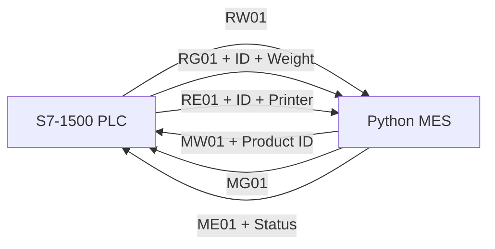
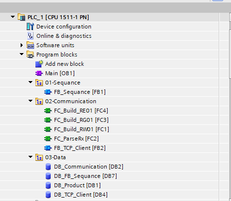
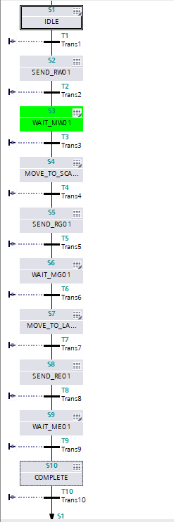
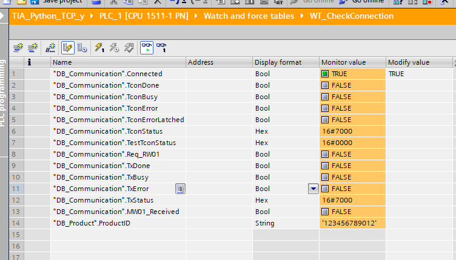
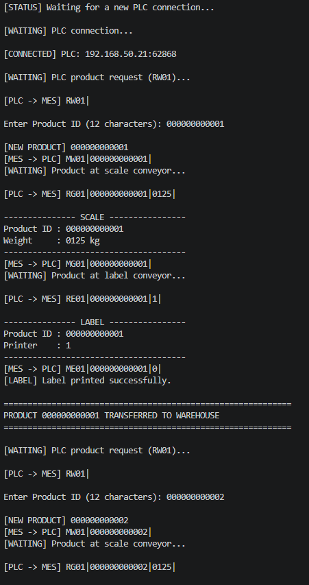

# S7-1500 ↔ Python MES TCP Communication

## Overview

This project demonstrates TCP/IP communication between a simulated **Siemens S7-1500 PLC** and a **Python-based MES simulator** using an ASCII-based protocol.

- **PLC:** TCP client
- **Python MES:** TCP server
- **TIA Portal:** V19
- **Simulation:** S7-PLCSIM Advanced
- **TCP Port:** 2000

---

## Communication Flow



The demo handles **one product at a time**.

```text
RW01 -> MW01 -> RG01 -> MG01 -> RE01 -> ME01
```

The MES requests a new 12-character Product ID only after the PLC sends `RW01`.

---

## Telegram Format

Messages are transferred as fixed-length **240-byte ASCII telegrams**.

```text
<STX>MessageID|Data1|Data2|...|<ETX>
```

- `STX` = `0x02`
- `ETX` = `0x03`
- Separator = `|`
- Unused bytes = ASCII spaces
- Product ID = 12 characters

Example:

```text
RW01|
MW01|000000000001|
RG01|000000000001|0125|
MG01|000000000001|
RE01|000000000001|1|
ME01|000000000001|0|
```

---

## PLC Program Structure



The PLC application is divided into three groups:

- **01-Sequence** — GRAPH product sequence
- **02-Communication** — TCP communication and telegram processing
- **03-Data** — Communication and product data blocks

### Main blocks

| Block | Purpose |
|---|---|
| `FB_Sequence` | Controls the product sequence with GRAPH |
| `FB_TCP_Client` | Handles TCP connection, send and receive logic |
| `FC_Build_RW01` | Builds the RW01 telegram |
| `FC_Build_RG01` | Builds the RG01 telegram |
| `FC_Build_RE01` | Builds the RE01 telegram |
| `FC_ParseRx` | Parses messages received from MES |

---

## GRAPH Sequence



```text
IDLE
 ↓
SEND_RW01
 ↓
WAIT_MW01
 ↓
MOVE_TO_SCALE
 ↓
SEND_RG01
 ↓
WAIT_MG01
 ↓
MOVE_TO_LABEL
 ↓
SEND_RE01
 ↓
WAIT_ME01
 ↓
COMPLETE
```

A new cycle should start only after the previous product reaches `COMPLETE`.

---

## Siemens TCP Instructions

The PLC uses Siemens **Open User Communication (OUC)**.

| Instruction | Purpose |
|---|---|
| `TCON` | Establishs the TCP connection |
| `TDISCON` | Closes the TCP connection |
| `TSEND` | Sends the prepared telegram |
| `TRCV` | Receives data into the PLC receive buffer |

Application flow:

```text
FC_Build_xx
   ↓
TxBuffer
   ↓
TSEND
   ↓
TCP
   ↓
Python MES
```

Receive flow:

```text
Python MES
   ↓
TRCV
   ↓
RxBuffer
   ↓
FC_ParseRx
```

---

## Communication Monitoring



Example communication status includes:

- TCP connection state
- TCON status
- Send status
- Receive acknowledgements
- Current Product ID

---

## Python MES Simulator



The Python server:

- Listens on TCP port `2000`
- Waits for `RW01`
- Requests a 12-character Product ID
- Sends `MW01`
- Acknowledges scale data with `MG01`
- Acknowledges label data with `ME01`
- Returns to waiting for the next product
- Continues listening after a PLC disconnect

Run:

```bash
python mes_server.py
```

---

## Example Simulation Network

```text
Host PC / Python MES : 192.168.50.1
PLCSIM Advanced PLC  : 192.168.50.20
Subnet Mask          : 255.255.255.0
TCP Port             : 2000
```

The IP addresses can be changed as long as the PLC connection parameters and Python server configuration match.

---

## Requirements

For the demo to run correctly:

- Python MES server must be running
- PLC communication must be enabled
- PLC and Python host must be reachable over TCP/IP
- The configured TCP port must match
- Only one product should be active at a time
- Product ID must contain exactly 12 ASCII characters

---

## References

### Project Protocol

The message structure is based on the project-specific **Communication between MES and PLC** specification.

### Siemens

PLC communication is implemented with Siemens **Open User Communication**:

- SIMATIC S7-1500 Communication Function Manual  
  https://support.industry.siemens.com/cs/ww/en/view/59192925

- Siemens Open User Communication documentation  
  https://docs.tia.siemens.cloud/

---

## Disclaimer

This project is intended for **education, simulation, and demonstration purposes**. It is not a production-ready MES interface.
