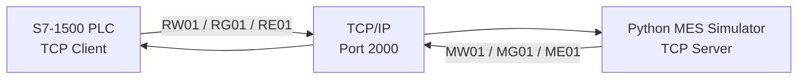
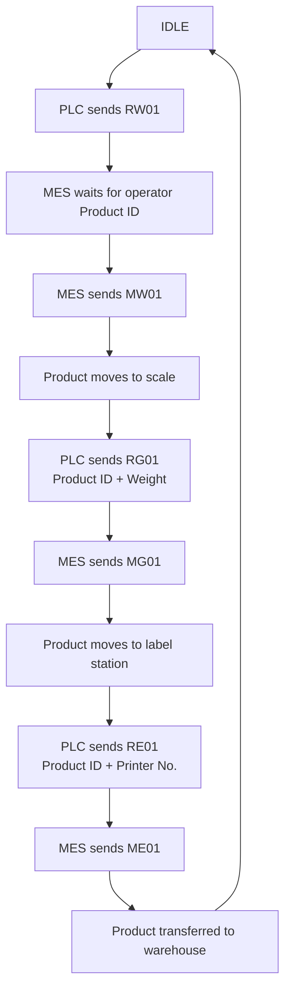

[README.md](https://github.com/user-attachments/files/32540120/README.md)
# TIA_PORTAL_TCP
Siemens S7-1500 to Python MES communication demo using TCP/IP
# S7-1500 ↔ Python MES TCP Communication Simulation

## Overview

This project demonstrates TCP/IP communication between a simulated Siemens S7-1500 PLC and a Python MES simulator using ASCII telegrams.

The PLC acts as the **active TCP client** and the Python application acts as the **TCP server**.

The process simulates a product moving through three logical stations:

1. Product entry / Product ID request
2. Scale conveyor / Weight reporting
3. Label station / Label confirmation

After the final acknowledgement, the product is considered transferred to the warehouse and the system becomes ready for the next product.

---


## System Architecture



### Communication roles

| Component | Role |
|---|---|
| S7-1500 | Active TCP client |
| Python MES simulator | TCP server / listener |
| Transport | TCP/IP |
| Application data | ASCII |
| Default demo port | 2000 |

The PLC establishes the connection using `TCON`, sends data with `TSEND`, receives data with `TRCV`, and terminates the connection with `TDISCON`.

The Python application listens continuously for a PLC connection. If the PLC disconnects, the Python server remains running and returns to:

```text
[WAITING] PLC connection...
```

---

# Application Protocol

The application-level message format is based on the project-specific **Communication between MES and PLC** specification used during development.

This application protocol is separate from the Siemens TCP implementation. Siemens documentation defines how the PLC establishes and uses TCP connections; the project-specific MES/PLC document defines the message IDs and payload format exchanged over that TCP connection.

## Telegram format

Each telegram has a fixed length of **240 bytes**.

```text
<STX>MessageID|Data1|Data2|...|<ETX>
```

Main rules:

- `STX` = `0x02`
- `ETX` = `0x03`
- Field separator = `|` (`0x7C`)
- Data is transferred as printable ASCII
- Message ID length = 4 characters
- Character fields are padded with trailing spaces
- Numeric fields are padded with leading zeroes
- Every TCP telegram in this demo is exactly 240 bytes
- Unused bytes are filled with ASCII space (`0x20`)

Because TCP is a stream protocol, the Python server uses a `recv_exact()` function to collect exactly 240 bytes before parsing a telegram.

---

# Message Sequence

| Direction | Message | Purpose |
|---|---|---|
| PLC → MES | `RW01` | Request a new Product ID |
| MES → PLC | `MW01` | Send Product ID to PLC |
| PLC → MES | `RG01` | Send Product ID and measured weight |
| MES → PLC | `MG01` | Acknowledge scale data |
| PLC → MES | `RE01` | Send Product ID and printer number |
| MES → PLC | `ME01` | Report label result |

Example cycle:

```text
PLC -> MES : RW01|
MES -> PLC : MW01|000000000001|

PLC -> MES : RG01|000000000001|0125|
MES -> PLC : MG01|000000000001|

PLC -> MES : RE01|000000000001|1|
MES -> PLC : ME01|000000000001|0|
```

In this demo:

```text
Weight      = 0125 kg
Printer No. = 1
Label 0     = OK
Label 1     = FAULT
```

`0 = OK` and `1 = FAULT` are the demo convention used by this implementation.

---

# Process Flow



The PLC sequence is implemented with a GRAPH Function Block.

Current sequence:

```text
S1   IDLE
S2   SEND_RW01
S3   WAIT_MW01
S4   MOVE_TO_SCALE
S5   SEND_RG01
S6   WAIT_MG01
S7   MOVE_TO_LABEL
S8   SEND_RE01
S9   WAIT_ME01
S10  COMPLETE
```

---

# Operating Conditions and Assumptions

For the current demo to operate correctly:

- The Python MES server must be running before the PLC attempts to establish the TCP connection.
- PLC communication must be enabled.
- The PLC and Python PC must be reachable on the same routed network.
- The configured PLC remote IP address must point to the PC running the Python server.
- The configured TCP port must match the Python server port.
- All communication instructions must use the same connection ID.
- A new product cycle should only start when the previous cycle has completed.
- **Only one product is handled at a time.**
- Product IDs must contain exactly **12 ASCII characters**.
- The MES asks for a Product ID only after receiving `RW01`.
- Product ID consistency is checked again at the scale and label stations.
- The current application does not buffer multiple products or multiple outstanding requests.

The single-product limitation is intentional. The Python simulator stores one `current_product_id` and follows one expected message sequence at a time.

---

# PLC Program Structure

The PLC program is separated into three logical groups.

```text
Program blocks
│
├── 01-Sequence
│   └── FB_Sequence
│
├── 02-Communication
│   ├── FB_TCP_Client
│   ├── FC_Build_RW01
│   ├── FC_Build_RG01
│   ├── FC_Build_RE01
│   └── FC_ParseRx
│
└── 03-Data
    ├── DB_Communication
    ├── DB_Product
    ├── DB_FB_Sequence
    └── DB_TCP_Client
```

## 01-Sequence

### `FB_Sequence`

Controls the product flow using GRAPH/SFC.

Its responsibility is to decide **when** a communication message must be sent and **which acknowledgement** is required before moving to the next process step.

The sequence logic is intentionally separated from the low-level TCP communication logic.

---

## 02-Communication

### `FB_TCP_Client`

Main communication block.

It coordinates:

- Connection establishment
- Connection status
- Send requests
- Receive handling
- Disconnect handling
- Communication diagnostics

It contains the Siemens OUC communication instructions used by the application.

### `FC_Build_RW01`

Builds the 240-byte `RW01` telegram in the transmit buffer.

### `FC_Build_RG01`

Builds the `RG01` telegram containing:

- Product ID
- Weight

### `FC_Build_RE01`

Builds the `RE01` telegram containing:

- Product ID
- Printer number

### `FC_ParseRx`

Parses telegrams received from the Python MES.

It identifies incoming message IDs such as:

```text
MW01
MG01
ME01
```

and extracts the required application data.

---

## 03-Data

### `DB_Communication`

Stores communication-related data such as:

- Connection parameters
- Connection state
- Send / receive buffers
- Request flags
- Receive flags
- Status words
- Diagnostic information

### `DB_Product`

Stores product-related data such as:

- Product ID
- Weight
- Printer number
- Label result

### Instance DBs

`DB_FB_Sequence` and `DB_TCP_Client` are instance DBs used by their corresponding Function Blocks.

Additional instance DBs may be generated or used by Siemens communication instructions.

---

# Siemens Communication Instructions

The project uses Siemens **Open User Communication** over TCP/IP.

## `TCON`

Establishes the programmed communication connection.

In this project, the S7-1500 is configured as the active connection partner and connects to the Python TCP server.

Connection parameters include items such as:

- Interface ID
- Connection ID
- Connection type
- Remote IPv4 address
- Remote port
- Active connection establishment

## `TDISCON`

Terminates an existing communication connection.

It is used when communication is disabled or when the connection must be closed before a new connection is established.

## `TSEND`

Sends data over an already established connection.

The application first builds a 240-byte telegram in the transmit buffer and then triggers `TSEND`.

```text
FC_Build_RG01
      ↓
TxBuffer[0..239]
      ↓
TSEND
      ↓
TCP
      ↓
Python MES
```

## `TRCV`

Receives data from the TCP connection into the PLC receive buffer.

After new data is received, `FC_ParseRx` evaluates the telegram and creates the corresponding application acknowledgement flags.

```text
Python MES
      ↓
TCP
      ↓
TRCV
      ↓
RxBuffer[0..239]
      ↓
FC_ParseRx
      ↓
MG01_Received
```

---

# Example Development Network

The following addresses were used during development and simulation:

```text
Host PC / Python MES : 192.168.50.1
PLCSIM Advanced PLC  : 192.168.50.20
Subnet Mask          : 255.255.255.0
TCP Port             : 2000
```

These addresses are only an example and can be changed.

The PLC `TCON_IP_v4` connection parameters and the Python server configuration must match the actual network configuration.

---

# Running the Demo

## 1. Start the Python MES simulator

```bash
python mes_server.py
```

Expected output:

```text
============================================================
        PLC - MES CONVEYOR SIMULATOR
============================================================
[LISTENING] TCP Port 2000

[WAITING] PLC connection...
```

## 2. Start the simulated S7-1500

Download the PLC project to S7-PLCSIM Advanced and place the CPU in RUN.

## 3. Enable communication

Set:

```text
DB_Communication.Enable = TRUE
```

The PLC establishes the TCP connection.

Python should report:

```text
[CONNECTED] PLC: <PLC-IP>:<dynamic-port>
```

## 4. Start a product cycle

Trigger the sequence start signal.

```text
"DB_Communication".Sequance_Start = TRUE
```

The PLC sends:

```text
RW01|
```

The Python MES then requests:

```text
Enter Product ID (12 characters):
```

Example:

```text
000000000001
```

The remaining scale and label messages are exchanged automatically.

## 5. Start another product

After the sequence returns to `IDLE`, trigger a new cycle.

The MES will request the next Product ID only after receiving the next `RW01`.

---

# Connection Recovery

The Python server is designed to remain active after a PLC disconnect.

```text
[DISCONNECTED] PLC connection lost.
[STATUS] PLC is not connected.
[STATUS] Waiting for a new PLC connection...

[WAITING] PLC connection...
```

When the PLC reconnects, a new MES session starts and the application state is reset to expect `RW01`.

---

# Reference Documentation

## Project-specific MES/PLC protocol

The application message structure and message IDs are based on the project communication specification:

```text
Communication between MES and PLC
```

This document defines:

- TCP/IP socket architecture
- PLC as active client
- MES as listening server
- 240-character ASCII telegrams
- STX / ETX framing
- Pipe-separated fields
- RW01 / MW01
- RG01 / MG01
- RE01 / ME01


## Siemens documentation

The PLC-side TCP implementation follows Siemens Open User Communication concepts and instructions.

### SIMATIC S7-1500 Communication Function Manual

https://support.industry.siemens.com/cs/ww/en/view/59192925

### Siemens STEP 7 — Open User Communication

**TCON — Establish communication connection**

https://docs.tia.siemens.cloud/r/en-us/v20/open-user-communication-s7-1200-s7-1500/other-s7-1200-s7-1500/tcon-establishing-a-communication-connection-s7-1200-s7-1500/tcon-establish-communication-connection-s7-1200-s7-1500

**TDISCON — Terminate communication connection**

https://docs.tia.siemens.cloud/r/en-us/v20/open-user-communication-s7-1200-s7-1500/other-s7-1200-s7-1500/tdiscon-terminate-communication-connection-s7-1200-s7-1500

**TSEND — Send data via communication connection**

https://docs.tia.siemens.cloud/r/en-us/v20/open-user-communication-s7-1200-s7-1500/other-s7-1200-s7-1500/tsend-send-data-via-communication-connection-s7-1200-s7-1500/tsend-send-data-via-communication-connection-s7-1200-s7-1500

**Connection configuration / `TCON_IP_v4`**

https://docs.tia.siemens.cloud/r/en-us/v20/editing-devices-and-networks/configure-networks/communication-via-connections/working-with-connections/using-open-user-communication-s7-1200-s7-1500-s7-1500t/connection-configuration-s7-1200-s7-1500-s7-1500t/overview-of-connection-configuration-s7-1200-s7-1500-s7-1500t

> The Siemens links above currently point to the V20 online documentation. The communication concepts and instructions used by this TIA Portal V19 project belong to the same Siemens Open User Communication family. Always check the documentation matching the TIA Portal and CPU firmware version used in a real project.

---

